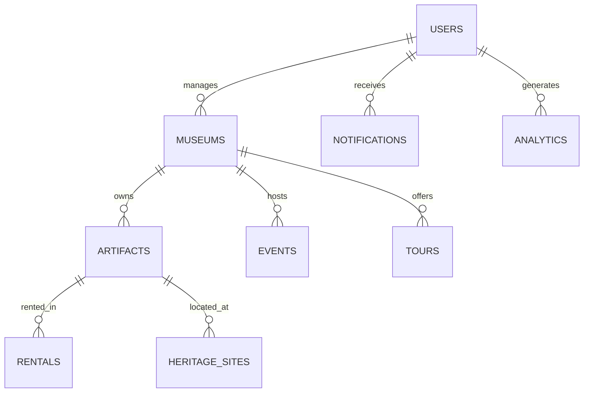

# 🗄️ EthioHeritage360 Database Documentation

## 📋 **Table of Contents**
1. [Database Overview](#database-overview)
2. [Database Schema](#database-schema)
3. [Collections Structure](#collections-structure)
4. [Relationships](#relationships)
5. [Indexes](#indexes)
6. [Data Types](#data-types)
7. [Validation Rules](#validation-rules)
8. [Sample Data](#sample-data)
9. [Migration Scripts](#migration-scripts)
10. [Performance Optimization](#performance-optimization)

---

## 🎯 **Database Overview**

**Database System**: MongoDB (NoSQL Document Database)
**Database Name**: `ethioheritage360`
**Connection URI**: `mongodb://localhost:27017/ethioheritage360`

### **Why MongoDB?**
- **Flexible Schema**: Accommodates diverse artifact metadata
- **Scalability**: Handles large collections and high traffic
- **Rich Queries**: Complex aggregation pipelines for analytics
- **JSON-Native**: Perfect for React/Node.js stack

---

## 📊 **Database Schema**

### **Collections Overview**
```
ethioheritage360/
├── 👤 users               # All system users (Super Admin, Museum Admin, Staff, Visitors)
├── 🏛️ museums             # Museum information and profiles
├── 🏺 artifacts           # Cultural artifacts and collections
├── 💰 rentals            # Artifact rental requests and transactions
├── 🎭 events             # Museum events and exhibitions
├── 📍 heritage_sites     # Cultural and historical sites
├── 🎫 tours              # Tour bookings and management
├── 📊 analytics          # System analytics and metrics
├── 🔔 notifications      # User notifications
├── ⚙️ system_settings    # Global platform settings
├── 📝 audit_logs         # System activity tracking
└── 💬 feedbacks          # User feedback and reviews
```

---

## 🗂️ **Collections Structure**

### 1. **👤 Users Collection**
```javascript
{
  _id: ObjectId,
  // Basic Information
  firstName: String,              // User's first name
  lastName: String,               // User's last name
  email: String,                  // Unique email address
  password: String,               // Hashed password (bcrypt)
  phone: String,                  // Phone number
  avatar: String,                 // Profile picture URL
  
  // Role & Permissions
  role: String,                   // 'superAdmin' | 'museumAdmin' | 'staff' | 'visitor'
  permissions: [String],          // Array of specific permissions
  isActive: Boolean,              // Account status
  isVerified: Boolean,            // Email verification status
  
  // Profile Details
  bio: String,                    // User biography
  dateOfBirth: Date,              // Birth date
  nationality: String,            // User's nationality
  languages: [String],            // Spoken languages
  interests: [String],            // Cultural interests
  
  // Museum Association (for Museum Admins/Staff)
  museumId: ObjectId,             // Reference to museums collection
  position: String,               // Job title/position
  department: String,             // Department within museum
  hireDate: Date,                 // Employment start date
  
  // Preferences
  preferences: {
    language: String,             // UI language preference
    notifications: {
      email: Boolean,
      push: Boolean,
      inApp: Boolean
    },
    privacy: {
      profileVisibility: String,  // 'public' | 'private'
      showEmail: Boolean,
      showPhone: Boolean
    }
  },
  
  // Activity Tracking
  lastLogin: Date,                // Last login timestamp
  loginCount: Number,             // Total login count
  ipAddress: String,              // Last known IP address
  
  // Timestamps
  createdAt: Date,                // Account creation date
  updatedAt: Date,                // Last modification date
  deletedAt: Date                 // Soft delete timestamp
}
```

### 2. **🏛️ Museums Collection**
```javascript
{
  _id: ObjectId,
  // Basic Information
  name: String,                   // Museum name
  description: String,            // Museum description
  type: String,                   // 'National' | 'Regional' | 'Private' | 'University'
  category: String,               // 'History' | 'Art' | 'Science' | 'Cultural'
  
  // Contact Information
  email: String,                  // Official email
  phone: String,                  // Contact phone
  website: String,                // Official website
  
  // Location
  address: {
    street: String,               // Street address
    city: String,                 // City
    region: String,               // State/Region
    country: String,              // Country
    postalCode: String,           // ZIP/Postal code
    coordinates: {                // GPS coordinates
      latitude: Number,
      longitude: Number
    }
  },
  
  // Operational Details
  establishedYear: Number,        // Year established
  operatingHours: {
    monday: { open: String, close: String },
    tuesday: { open: String, close: String },
    wednesday: { open: String, close: String },
    thursday: { open: String, close: String },
    friday: { open: String, close: String },
    saturday: { open: String, close: String },
    sunday: { open: String, close: String }
  },
  
  // Pricing
  admissionFee: {
    adult: Number,                // Adult ticket price
    child: Number,                // Child ticket price
    student: Number,              // Student discount price
    senior: Number,               // Senior citizen price
    group: Number                 // Group booking price
  },
  
  // Media
  logo: String,                   // Museum logo URL
  images: [String],               // Array of image URLs
  virtualTourUrl: String,         // 360° tour link
  
  // Social Media
  socialMedia: {
    facebook: String,
    twitter: String,
    instagram: String,
    youtube: String
  },
  
  // Statistics
  stats: {
    totalArtifacts: Number,       // Total artifacts count
    totalVisitors: Number,        // All-time visitors
    monthlyVisitors: Number,      // Current month visitors
    rating: Number,               // Average rating
    reviewCount: Number           // Total reviews
  },
  
  // Status & Verification
  status: String,                 // 'pending' | 'approved' | 'suspended' | 'active'
  isVerified: Boolean,            // Verification status
  verificationDate: Date,         // Date of verification
  
  // Admin Information
  adminId: ObjectId,              // Reference to museum admin user
  
  // Timestamps
  createdAt: Date,
  updatedAt: Date,
  deletedAt: Date
}
```

### 3. **🏺 Artifacts Collection**
```javascript
{
  _id: ObjectId,
  // Basic Information
  name: String,                   // Artifact name
  localName: String,              // Name in local language
  description: String,            // Detailed description
  shortDescription: String,       // Brief summary
  
  // Classification
  category: String,               // 'Pottery' | 'Jewelry' | 'Weapons' | 'Art' | 'Religious'
  subcategory: String,            // More specific classification
  tags: [String],                 // Search tags
  
  // Historical Context
  historicalPeriod: String,       // 'Ancient' | 'Medieval' | 'Modern'
  era: String,                    // Specific era/dynasty
  century: String,                // Century of origin
  estimatedAge: Number,           // Age in years
  
  // Origin & Discovery
  origin: {
    region: String,               // Geographic region
    city: String,                 // City of origin
    site: String,                 // Archaeological site
    discoveryDate: Date,          // When discovered
    discoveredBy: String,         // Who discovered it
    excavationDetails: String     // Excavation information
  },
  
  // Physical Properties
  dimensions: {
    height: Number,               // Height in cm
    width: Number,                // Width in cm
    depth: Number,                // Depth in cm
    weight: Number,               // Weight in grams
    diameter: Number              // Diameter if applicable
  },
  
  // Material & Condition
  materials: [String],            // Materials used
  techniques: [String],           // Construction techniques
  condition: String,              // 'Excellent' | 'Good' | 'Fair' | 'Poor'
  conservationHistory: String,    // Conservation work done
  
  // Museum Information
  museumId: ObjectId,             // Reference to museums collection
  inventoryNumber: String,        // Museum inventory ID
  acquisitionDate: Date,          // When museum acquired it
  acquisitionMethod: String,      // 'Purchase' | 'Donation' | 'Discovery'
  
  // Digital Assets
  images: [{
    url: String,                  // Image URL
    caption: String,              // Image description
    isPrimary: Boolean,           // Main display image
    resolution: String,           // Image resolution
    fileSize: Number              // File size in bytes
  }],
  
  // 3D/AR Assets
  model3D: {
    url: String,                  // 3D model file URL
    format: String,               // File format (glb, obj, etc.)
    fileSize: Number,             // File size
    vertices: Number,             // Model complexity
    hasAR: Boolean                // AR capability
  },
  
  // Multilingual Support
  translations: {
    amharic: {
      name: String,
      description: String
    },
    oromo: {
      name: String,
      description: String
    },
    tigrinya: {
      name: String,
      description: String
    }
  },
  
  // Engagement Metrics
  stats: {
    views: Number,                // Total views
    likes: Number,                // Total likes
    shares: Number,               // Times shared
    bookmarks: Number,            // Times bookmarked
    downloads: Number             // 3D model downloads
  },
  
  // Availability
  isPublic: Boolean,              // Publicly visible
  isForRent: Boolean,             // Available for rental
  rentalPrice: Number,            // Daily rental price
  insuranceRequired: Boolean,     // Insurance requirement
  
  // Status & Approval
  status: String,                 // 'draft' | 'pending' | 'approved' | 'rejected'
  approvalStatus: {
    museumAdmin: String,          // Museum admin approval
    superAdmin: String,           // Super admin approval
    comments: String,             // Approval/rejection comments
    reviewDate: Date              // Review date
  },
  
  // Metadata
  createdBy: ObjectId,            // User who created record
  lastModifiedBy: ObjectId,       // User who last modified
  
  // Timestamps
  createdAt: Date,
  updatedAt: Date,
  deletedAt: Date
}
```

### 4. **💰 Rentals Collection**
```javascript
{
  _id: ObjectId,
  // Request Information
  requestId: String,              // Unique request identifier
  artifactId: ObjectId,           // Reference to artifacts collection
  renterInfo: {
    name: String,                 // Renter's full name
    organization: String,         // Institution/company
    email: String,                // Contact email
    phone: String,                // Contact phone
    address: String,              // Full address
    purpose: String,              // Rental purpose
    credentials: String           // Professional credentials
  },
  
  // Rental Details
  rentalPeriod: {
    startDate: Date,              // Rental start date
    endDate: Date,                // Rental end date
    duration: Number,             // Duration in days
    extensionRequested: Boolean,  // Extension request flag
    extensionDays: Number,        // Additional days requested
    actualReturnDate: Date        // Actual return date
  },
  
  // Financial Information
  pricing: {
    dailyRate: Number,            // Daily rental rate
    totalAmount: Number,          // Total rental cost
    securityDeposit: Number,      // Security deposit amount
    insuranceCost: Number,        // Insurance premium
    lateFees: Number,             // Late return fees
    finalAmount: Number           // Final total amount
  },
  
  // Insurance & Documentation
  insurance: {
    required: Boolean,            // Insurance requirement
    policyNumber: String,         // Insurance policy number
    provider: String,             // Insurance company
    coverage: Number,             // Coverage amount
    documents: [String]           // Insurance document URLs
  },
  
  // Legal Documents
  documents: {
    contract: String,             // Rental contract URL
    agreement: String,            // Rental agreement URL
    receipt: String,              // Payment receipt URL
    returnCertificate: String     // Return certificate URL
  },
  
  // Approval Workflow
  approvalFlow: {
    museumAdmin: {
      status: String,             // 'pending' | 'approved' | 'rejected'
      reviewedBy: ObjectId,       // Museum admin user ID
      reviewDate: Date,           // Review date
      comments: String,           // Review comments
      conditions: String          // Special conditions
    },
    superAdmin: {
      status: String,             // 'pending' | 'approved' | 'rejected'
      reviewedBy: ObjectId,       // Super admin user ID
      reviewDate: Date,           // Review date
      comments: String,           // Review comments
      finalDecision: String       // Final approval decision
    }
  },
  
  // Status Tracking
  status: String,                 // 'pending' | 'approved' | 'active' | 'returned' | 'overdue' | 'cancelled'
  timeline: [{
    status: String,               // Status change
    timestamp: Date,              // When changed
    changedBy: ObjectId,          // Who changed it
    notes: String                 // Change notes
  }],
  
  // Communication
  messages: [{
    sender: ObjectId,             // Message sender
    message: String,              // Message content
    timestamp: Date,              // Message time
    isRead: Boolean               // Read status
  }],
  
  // Condition Reports
  conditionReports: {
    preRental: {
      condition: String,          // Condition before rental
      photos: [String],           // Condition photos
      notes: String,              // Inspector notes
      inspector: ObjectId,        // Inspector user ID
      date: Date                  // Inspection date
    },
    postRental: {
      condition: String,          // Condition after return
      photos: [String],           // Return condition photos
      notes: String,              // Inspector notes
      inspector: ObjectId,        // Inspector user ID
      date: Date,                 // Inspection date
      damages: String             // Any damages found
    }
  },
  
  // Timestamps
  createdAt: Date,
  updatedAt: Date,
  deletedAt: Date
}
```

### 5. **🎭 Events Collection**
```javascript
{
  _id: ObjectId,
  // Basic Information
  title: String,                  // Event title
  description: String,            // Event description
  type: String,                   // 'Exhibition' | 'Workshop' | 'Lecture' | 'Tour' | 'Festival'
  category: String,               // Event category
  
  // Organization
  museumId: ObjectId,             // Host museum
  organizer: {
    name: String,                 // Organizer name
    email: String,                // Contact email
    phone: String                 // Contact phone
  },
  
  // Schedule
  schedule: {
    startDate: Date,              // Event start date
    endDate: Date,                // Event end date
    startTime: String,            // Daily start time
    endTime: String,              // Daily end time
    duration: Number,             // Duration in minutes
    timezone: String,             // Timezone
    isRecurring: Boolean,         // Recurring event flag
    recurrencePattern: String     // Daily/Weekly/Monthly
  },
  
  // Venue
  venue: {
    name: String,                 // Venue name
    address: String,              // Venue address
    capacity: Number,             // Maximum attendees
    isVirtual: Boolean,           // Virtual event flag
    streamingUrl: String,         // Live stream URL
    meetingId: String             // Virtual meeting ID
  },
  
  // Ticketing
  ticketing: {
    isFree: Boolean,              // Free event flag
    prices: {
      general: Number,            // General admission
      student: Number,            // Student price
      member: Number,             // Museum member price
      group: Number               // Group booking price
    },
    totalTickets: Number,         // Total available tickets
    ticketsSold: Number,          // Tickets sold
    ticketsRemaining: Number,     // Remaining tickets
    salesStartDate: Date,         // Ticket sales start
    salesEndDate: Date            // Ticket sales end
  },
  
  // Content
  content: {
    images: [String],             // Event images
    videos: [String],             // Promotional videos
    documents: [String],          // Related documents
    playlist: [String]            // Audio/video playlist
  },
  
  // Speakers/Performers
  speakers: [{
    name: String,                 // Speaker name
    bio: String,                  // Speaker biography
    photo: String,                // Speaker photo
    role: String,                 // Speaker role/title
    topic: String                 // Speaking topic
  }],
  
  // Target Audience
  targetAudience: {
    ageGroups: [String],          // Age groups
    interests: [String],          // Interest categories
    experienceLevel: String,      // Beginner/Intermediate/Advanced
    languages: [String]           // Event languages
  },
  
  // Registration
  registration: {
    required: Boolean,            // Registration requirement
    deadline: Date,               // Registration deadline
    maxAttendees: Number,         // Maximum attendees
    currentAttendees: Number,     // Current registrations
    waitingList: Boolean,         // Waiting list enabled
    questions: [String]           // Registration questions
  },
  
  // Marketing
  promotion: {
    featured: Boolean,            // Featured event
    socialMedia: {
      facebook: String,
      twitter: String,
      instagram: String
    },
    hashtags: [String],           // Event hashtags
    pressRelease: String          // Press release URL
  },
  
  // Status & Analytics
  status: String,                 // 'draft' | 'published' | 'active' | 'completed' | 'cancelled'
  analytics: {
    views: Number,                // Event page views
    registrations: Number,        // Total registrations
    attendance: Number,           // Actual attendance
    rating: Number,               // Average rating
    feedback: [String]            // Feedback comments
  },
  
  // Timestamps
  createdAt: Date,
  updatedAt: Date,
  publishedAt: Date,
  deletedAt: Date
}
```

### 6. **📍 Heritage Sites Collection**
```javascript
{
  _id: ObjectId,
  // Basic Information
  name: String,                   // Site name
  localName: String,              // Local language name
  description: String,            // Site description
  significance: String,           // Historical significance
  
  // Classification
  type: String,                   // 'Archaeological' | 'Historical' | 'Religious' | 'Natural'
  category: String,               // More specific category
  designation: String,            // 'UNESCO' | 'National' | 'Regional' | 'Local'
  
  // Location
  location: {
    region: String,               // Region/state
    zone: String,                 // Administrative zone
    woreda: String,               // Woreda/district
    city: String,                 // Nearest city
    coordinates: {
      latitude: Number,
      longitude: Number
    },
    altitude: Number,             // Elevation above sea level
    accessibility: String         // Access difficulty level
  },
  
  // Historical Information
  history: {
    established: String,          // When established/built
    period: String,               // Historical period
    civilization: String,         // Associated civilization
    dynasty: String,              // Ruling dynasty
    archaeologist: String,        // Discovered/studied by
    excavationYear: Number        // Year of excavation
  },
  
  // Physical Characteristics
  features: {
    area: Number,                 // Site area in hectares
    structures: [String],         // Types of structures
    materials: [String],          // Construction materials
    condition: String,            // Current condition
    threats: [String]             // Conservation threats
  },
  
  // Visitor Information
  visitorInfo: {
    isOpen: Boolean,              // Open to public
    visitingHours: String,        // Opening hours
    entryFee: Number,             // Admission fee
    guidedTours: Boolean,         // Guided tours available
    facilities: [String],         // Available facilities
    bestVisitTime: String,        // Best time to visit
    restrictions: String          // Visitor restrictions
  },
  
  // Media Assets
  media: {
    images: [{
      url: String,
      caption: String,
      photographer: String,
      date: Date
    }],
    videos: [String],             // Video URLs
    virtualTour: String,          // 360° tour URL
    audioGuide: String,           // Audio guide URL
    documentaries: [String]       // Documentary links
  },
  
  // Cultural Information
  cultural: {
    associatedGroups: [String],   // Associated ethnic groups
    traditions: [String],         // Cultural traditions
    festivals: [String],          // Related festivals
    legends: String,              // Local legends/stories
    rituals: String               // Religious/cultural rituals
  },
  
  // Conservation
  conservation: {
    status: String,               // Conservation status
    threats: [String],            // Current threats
    projects: [String],           // Conservation projects
    funding: [String],            // Funding sources
    lastAssessment: Date,         // Last assessment date
    recommendations: String       // Conservation recommendations
  },
  
  // Research & Documentation
  research: {
    publications: [String],       // Research publications
    scholars: [String],           // Researchers involved
    ongoingStudies: [String],     // Current research
    discoveries: [String],        // Recent discoveries
    archives: String              // Archive locations
  },
  
  // Tourism Impact
  tourism: {
    annualVisitors: Number,       // Annual visitor count
    economicImpact: Number,       // Local economic impact
    employmentGenerated: Number,  // Jobs created
    tourismGrowth: Number,        // Growth rate
    seasonality: String           // Peak seasons
  },
  
  // Management
  management: {
    authority: String,            // Managing authority
    contactPerson: String,        // Site manager
    email: String,                // Contact email
    phone: String,                // Contact phone
    lastInspection: Date,         // Last inspection
    managementPlan: String        // Management plan URL
  },
  
  // Status & Verification
  status: String,                 // 'active' | 'under_construction' | 'closed' | 'restricted'
  verified: Boolean,              // Verification status
  
  // Timestamps
  createdAt: Date,
  updatedAt: Date,
  deletedAt: Date
}
```

### 7. **🎫 Tours Collection**
```javascript
{
  _id: ObjectId,
  // Tour Information
  title: String,                  // Tour title
  description: String,            // Tour description
  type: String,                   // 'Physical' | 'Virtual' | 'Hybrid'
  category: String,               // 'Cultural' | 'Historical' | 'Archaeological'
  
  // Tour Details
  details: {
    duration: Number,             // Duration in hours
    difficulty: String,           // 'Easy' | 'Moderate' | 'Challenging'
    maxParticipants: Number,      // Maximum group size
    minAge: Number,               // Minimum age requirement
    languages: [String],          // Available languages
    included: [String],           // What's included
    requirements: [String]        // Participant requirements
  },
  
  // Itinerary
  itinerary: [{
    stop: Number,                 // Stop number
    location: String,             // Location name
    description: String,          // Stop description
    duration: Number,             // Time at location (minutes)
    coordinates: {
      latitude: Number,
      longitude: Number
    },
    images: [String],             // Location images
    activities: [String]          // Activities at stop
  }],
  
  // Scheduling
  schedule: {
    startDates: [Date],           // Available start dates
    timeSlots: [String],          // Time options
    frequency: String,            // 'Daily' | 'Weekly' | 'Monthly'
    seasonality: String,          // Seasonal availability
    blackoutDates: [Date]         // Unavailable dates
  },
  
  // Pricing
  pricing: {
    adult: Number,                // Adult price
    child: Number,                // Child price
    student: Number,              // Student price
    senior: Number,               // Senior price
    group: Number,                // Group discount price (per person)
    currency: String,             // Currency code
    includes: [String],           // Price includes
    excludes: [String]            // Price excludes
  },
  
  // Tour Guide Information
  guides: [{
    guideId: ObjectId,            // Reference to user
    name: String,                 // Guide name
    languages: [String],          // Languages spoken
    specializations: [String],    // Areas of expertise
    experience: Number,           // Years of experience
    rating: Number,               // Average rating
    bio: String,                  // Guide biography
    photo: String                 // Guide photo
  }],
  
  // Booking Information
  bookings: [{
    bookingId: ObjectId,          // Unique booking ID
    customerInfo: {
      name: String,
      email: String,
      phone: String,
      nationality: String,
      specialRequests: String
    },
    participants: Number,         // Number of participants
    date: Date,                   // Tour date
    timeSlot: String,             // Selected time
    totalAmount: Number,          // Total cost
    paymentStatus: String,        // Payment status
    bookingStatus: String,        // Booking status
    createdAt: Date
  }],
  
  // Media Content
  media: {
    coverImage: String,           // Main tour image
    gallery: [String],            // Tour images
    video: String,                // Promotional video
    virtualPreview: String,       // Virtual tour preview
    audioIntro: String,           // Audio introduction
    brochure: String              // Digital brochure
  },
  
  // Reviews & Ratings
  reviews: [{
    customerId: ObjectId,         // Customer reference
    rating: Number,               // 1-5 stars
    comment: String,              // Review text
    date: Date,                   // Review date
    verified: Boolean,            // Verified booking
    helpful: Number               // Helpful votes
  }],
  
  // Operational Details
  operations: {
    meetingPoint: String,         // Where tour starts
    endPoint: String,             // Where tour ends
    transportation: String,       // Transport method
    equipment: [String],          // Provided equipment
    safety: [String],             // Safety measures
    weatherPolicy: String,        // Weather cancellation policy
    cancellationPolicy: String    // Cancellation terms
  },
  
  // Analytics
  analytics: {
    totalBookings: Number,        // All-time bookings
    totalRevenue: Number,         // Total revenue
    averageRating: Number,        // Average customer rating
    repeatCustomers: Number,      // Repeat customer count
    seasonalTrends: Object,       // Booking patterns
    popularTimeSlots: [String]    // Most popular times
  },
  
  // Status & Availability
  status: String,                 // 'active' | 'inactive' | 'seasonal' | 'suspended'
  featured: Boolean,              // Featured tour
  availability: Boolean,          // Currently available
  
  // Provider Information
  providerId: ObjectId,           // Tour provider/museum
  
  // Timestamps
  createdAt: Date,
  updatedAt: Date,
  deletedAt: Date
}
```

### 8. **📊 Analytics Collection**
```javascript
{
  _id: ObjectId,
  // Analytics Type
  type: String,                   // 'daily' | 'weekly' | 'monthly' | 'yearly'
  category: String,               // 'visitors' | 'artifacts' | 'revenue' | 'engagement'
  
  // Time Period
  period: {
    date: Date,                   // Specific date
    year: Number,                 // Year
    month: Number,                // Month (1-12)
    week: Number,                 // Week number
    day: Number                   // Day of month
  },
  
  // Visitor Analytics
  visitors: {
    total: Number,                // Total visitors
    unique: Number,               // Unique visitors
    returning: Number,            // Returning visitors
    newUsers: Number,             // New registrations
    demographics: {
      ageGroups: {
        '18-24': Number,
        '25-34': Number,
        '35-44': Number,
        '45-54': Number,
        '55-64': Number,
        '65+': Number
      },
      gender: {
        male: Number,
        female: Number,
        other: Number
      },
      locations: [{
        country: String,
        count: Number
      }],
      devices: {
        desktop: Number,
        mobile: Number,
        tablet: Number
      }
    }
  },
  
  // Artifact Analytics
  artifacts: {
    totalViews: Number,           // Total artifact views
    uniqueViews: Number,          // Unique artifact views
    mostViewed: [{
      artifactId: ObjectId,
      views: Number,
      name: String
    }],
    categoryViews: [{
      category: String,
      views: Number
    }],
    downloads: Number,            // 3D model downloads
    shares: Number,               // Social shares
    bookmarks: Number             // Times bookmarked
  },
  
  // Revenue Analytics
  revenue: {
    total: Number,                // Total revenue
    sources: {
      tours: Number,              // Tour bookings
      events: Number,             // Event tickets
      rentals: Number,            // Artifact rentals
      admissions: Number,         // Museum admissions
      merchandise: Number,        // Gift shop sales
      donations: Number           // Donations received
    },
    transactions: Number,         // Total transactions
    averageValue: Number,         // Average transaction value
    refunds: Number               // Total refunds
  },
  
  // Engagement Metrics
  engagement: {
    sessionDuration: Number,      // Average session duration
    pageViews: Number,            // Total page views
    bounceRate: Number,           // Bounce rate percentage
    interactions: {
      likes: Number,              // Total likes
      shares: Number,             // Total shares
      comments: Number,           // Total comments
      bookmarks: Number,          // Total bookmarks
      downloads: Number           // Total downloads
    },
    searchQueries: [{
      query: String,
      count: Number
    }]
  },
  
  // Geographic Data
  geographic: {
    countries: [{
      name: String,
      code: String,
      visitors: Number,
      revenue: Number
    }],
    regions: [{
      name: String,
      visitors: Number,
      revenue: Number
    }],
    cities: [{
      name: String,
      visitors: Number,
      revenue: Number
    }]
  },
  
  // Performance Metrics
  performance: {
    pageLoadTime: Number,         // Average load time
    serverResponseTime: Number,   // API response time
    errorRate: Number,            // Error percentage
    uptime: Number,               // System uptime
    apiCalls: Number,             // Total API calls
    databaseQueries: Number       // Database query count
  },
  
  // Social Media Metrics
  socialMedia: {
    mentions: Number,             // Brand mentions
    followers: {
      facebook: Number,
      twitter: Number,
      instagram: Number,
      youtube: Number
    },
    reach: Number,                // Social media reach
    engagement: Number,           // Social engagement rate
    referralTraffic: Number       // Traffic from social media
  },
  
  // Content Analytics
  content: {
    mostPopularPages: [{
      page: String,
      views: Number
    }],
    contentTypes: [{
      type: String,
      consumption: Number
    }],
    userGeneratedContent: {
      reviews: Number,
      photos: Number,
      videos: Number
    }
  },
  
  // Museum-Specific Analytics (if applicable)
  museumId: ObjectId,             // Reference to museum
  
  // Timestamps
  createdAt: Date,
  updatedAt: Date
}
```

### 9. **🔔 Notifications Collection**
```javascript
{
  _id: ObjectId,
  // Recipient Information
  userId: ObjectId,               // Recipient user ID
  role: String,                   // User role for targeting
  
  // Notification Content
  title: String,                  // Notification title
  message: String,                // Notification message
  type: String,                   // 'info' | 'warning' | 'error' | 'success'
  category: String,               // 'rental' | 'artifact' | 'event' | 'system' | 'reminder'
  
  // Priority & Urgency
  priority: String,               // 'low' | 'medium' | 'high' | 'urgent'
  urgent: Boolean,                // Urgent flag
  
  // Action Required
  actionRequired: Boolean,        // Requires user action
  actionUrl: String,              // URL to action page
  actionText: String,             // Action button text
  deadline: Date,                 // Action deadline
  
  // Related Resources
  relatedEntity: {
    type: String,                 // 'artifact' | 'rental' | 'event' | 'user'
    id: ObjectId,                 // Related entity ID
    name: String                  // Entity name for display
  },
  
  // Delivery Channels
  channels: {
    inApp: {
      sent: Boolean,              // In-app notification sent
      read: Boolean,              // Read status
      readAt: Date                // When read
    },
    email: {
      enabled: Boolean,           // Email notification enabled
      sent: Boolean,              // Email sent
      sentAt: Date,               // When sent
      opened: Boolean,            // Email opened
      openedAt: Date              // When opened
    },
    push: {
      enabled: Boolean,           // Push notification enabled
      sent: Boolean,              // Push sent
      sentAt: Date,               // When sent
      clicked: Boolean,           // Push clicked
      clickedAt: Date             // When clicked
    }
  },
  
  // Scheduling
  scheduledFor: Date,             // When to send
  expiresAt: Date,                // Notification expiry
  
  // Status
  status: String,                 // 'pending' | 'sent' | 'read' | 'expired' | 'failed'
  
  // Metadata
  metadata: {
    source: String,               // Notification source
    campaignId: String,           // Campaign identifier
    templateId: String,           // Template used
    batchId: String               // Batch identifier
  },
  
  // Timestamps
  createdAt: Date,
  updatedAt: Date,
  deletedAt: Date
}
```

### 10. **⚙️ System Settings Collection**
```javascript
{
  _id: ObjectId,
  // Setting Identification
  key: String,                    // Unique setting key
  category: String,               // Setting category
  
  // Setting Value
  value: Mixed,                   // Setting value (any type)
  defaultValue: Mixed,            // Default value
  dataType: String,               // 'string' | 'number' | 'boolean' | 'object' | 'array'
  
  // Setting Metadata
  name: String,                   // Display name
  description: String,            // Setting description
  
  // Permissions
  isPublic: Boolean,              // Publicly accessible
  editableBy: [String],           // Roles that can edit
  viewableBy: [String],           // Roles that can view
  
  // Validation
  validation: {
    required: Boolean,            // Required setting
    min: Number,                  // Minimum value
    max: Number,                  // Maximum value
    pattern: String,              // Regex pattern
    options: [String]             // Valid options
  },
  
  // Change Tracking
  lastModifiedBy: ObjectId,       // Who last modified
  changeHistory: [{
    value: Mixed,                 // Previous value
    changedBy: ObjectId,          // Who changed it
    changedAt: Date,              // When changed
    reason: String                // Change reason
  }],
  
  // Status
  isActive: Boolean,              // Setting active
  
  // Timestamps
  createdAt: Date,
  updatedAt: Date
}
```

---

## 🔗 **Relationships**

### **Primary Relationships**

1. **Users → Museums**: One-to-One (Museum Admin)
2. **Museums → Artifacts**: One-to-Many
3. **Artifacts → Rentals**: One-to-Many
4. **Museums → Events**: One-to-Many
5. **Users → Notifications**: One-to-Many
6. **Museums → Tours**: One-to-Many

### **Relationship Diagram**


---

## 📈 **Indexes**

### **Performance Indexes**

```javascript
// Users Collection
db.users.createIndex({ email: 1 }, { unique: true })
db.users.createIndex({ role: 1 })
db.users.createIndex({ isActive: 1 })
db.users.createIndex({ museumId: 1 })
db.users.createIndex({ createdAt: -1 })

// Museums Collection
db.museums.createIndex({ name: 1 })
db.museums.createIndex({ status: 1 })
db.museums.createIndex({ "address.coordinates": "2dsphere" })
db.museums.createIndex({ adminId: 1 })

// Artifacts Collection
db.artifacts.createIndex({ museumId: 1 })
db.artifacts.createIndex({ category: 1, subcategory: 1 })
db.artifacts.createIndex({ status: 1 })
db.artifacts.createIndex({ isPublic: 1 })
db.artifacts.createIndex({ "stats.views": -1 })
db.artifacts.createIndex({ tags: 1 })
db.artifacts.createIndex({ name: "text", description: "text" })

// Rentals Collection
db.rentals.createIndex({ artifactId: 1 })
db.rentals.createIndex({ status: 1 })
db.rentals.createIndex({ "rentalPeriod.startDate": 1 })
db.rentals.createIndex({ "approvalFlow.museumAdmin.status": 1 })

// Events Collection
db.events.createIndex({ museumId: 1 })
db.events.createIndex({ status: 1 })
db.events.createIndex({ "schedule.startDate": 1 })
db.events.createIndex({ type: 1, category: 1 })

// Heritage Sites Collection
db.heritage_sites.createIndex({ "location.coordinates": "2dsphere" })
db.heritage_sites.createIndex({ type: 1 })
db.heritage_sites.createIndex({ status: 1 })

// Tours Collection
db.tours.createIndex({ providerId: 1 })
db.tours.createIndex({ status: 1 })
db.tours.createIndex({ type: 1 })
db.tours.createIndex({ "pricing.adult": 1 })

// Analytics Collection
db.analytics.createIndex({ type: 1, category: 1 })
db.analytics.createIndex({ "period.date": -1 })
db.analytics.createIndex({ museumId: 1 })

// Notifications Collection
db.notifications.createIndex({ userId: 1 })
db.notifications.createIndex({ status: 1 })
db.notifications.createIndex({ priority: 1 })
db.notifications.createIndex({ createdAt: -1 })

// System Settings Collection
db.system_settings.createIndex({ key: 1 }, { unique: true })
db.system_settings.createIndex({ category: 1 })
```

---

## 🎯 **Sample Data Examples**

### **Sample User (Super Admin)**
```json
{
  "_id": "ObjectId('64f8b1234567890abcdef123')",
  "firstName": "Admin",
  "lastName": "User",
  "email": "admin@ethioheritage360.com",
  "password": "$2b$10$hashedPasswordHere",
  "role": "superAdmin",
  "permissions": ["all"],
  "isActive": true,
  "isVerified": true,
  "preferences": {
    "language": "en",
    "notifications": {
      "email": true,
      "push": true,
      "inApp": true
    }
  },
  "createdAt": "2024-01-15T08:00:00.000Z",
  "updatedAt": "2024-01-15T08:00:00.000Z"
}
```

### **Sample Museum**
```json
{
  "_id": "ObjectId('64f8b2345678901bcdef234')",
  "name": "National Museum of Ethiopia",
  "description": "The premier museum showcasing Ethiopia's rich cultural heritage",
  "type": "National",
  "category": "History",
  "email": "info@nationalmuseum.et",
  "phone": "+251-11-117-150",
  "address": {
    "street": "King George VI Street",
    "city": "Addis Ababa",
    "region": "Addis Ababa",
    "country": "Ethiopia",
    "coordinates": {
      "latitude": 9.0320,
      "longitude": 38.7469
    }
  },
  "establishedYear": 1958,
  "status": "active",
  "isVerified": true,
  "createdAt": "2024-01-15T09:00:00.000Z"
}
```

---

## 🔧 **Migration Scripts**

### **Initial Database Setup**
```javascript
// scripts/init-database.js
const mongoose = require('mongoose');

async function initializeDatabase() {
  try {
    // Connect to MongoDB
    await mongoose.connect(process.env.MONGODB_URI);
    
    // Create collections with validation
    await createCollections();
    
    // Create indexes
    await createIndexes();
    
    // Seed initial data
    await seedInitialData();
    
    console.log('✅ Database initialized successfully');
  } catch (error) {
    console.error('❌ Database initialization failed:', error);
  }
}
```

### **Data Migration Template**
```javascript
// scripts/migrate-v1-to-v2.js
async function migrateV1ToV2() {
  const db = mongoose.connection.db;
  
  // Add new fields to existing documents
  await db.collection('artifacts').updateMany(
    { translations: { $exists: false } },
    { $set: { translations: {} } }
  );
  
  // Migrate data structure
  await db.collection('users').updateMany(
    { preferences: { $exists: false } },
    { $set: { preferences: { language: 'en' } } }
  );
}
```

---

## ⚡ **Performance Optimization**

### **Query Optimization Guidelines**

1. **Use Indexes**: Always query on indexed fields
2. **Limit Results**: Use `.limit()` for large collections
3. **Project Fields**: Only select needed fields
4. **Avoid N+1 Queries**: Use aggregation pipelines
5. **Cache Frequent Queries**: Implement Redis caching

### **Aggregation Pipeline Examples**

```javascript
// Get museum statistics
const museumStats = await Museum.aggregate([
  {
    $lookup: {
      from: 'artifacts',
      localField: '_id',
      foreignField: 'museumId',
      as: 'artifacts'
    }
  },
  {
    $project: {
      name: 1,
      totalArtifacts: { $size: '$artifacts' },
      publicArtifacts: {
        $size: {
          $filter: {
            input: '$artifacts',
            cond: { $eq: ['$$this.isPublic', true] }
          }
        }
      }
    }
  }
]);
```

### **Connection Optimization**
```javascript
// mongoose configuration
mongoose.connect(MONGODB_URI, {
  maxPoolSize: 10,          // Maximum connections
  serverSelectionTimeoutMS: 5000,
  socketTimeoutMS: 45000,
  bufferCommands: false,
  bufferMaxEntries: 0
});
```

---

## 📊 **Backup & Recovery**

### **Automated Backup Script**
```bash
#!/bin/bash
# scripts/backup.sh

DATE=$(date +%Y%m%d_%H%M%S)
BACKUP_DIR="/backups/ethioheritage360"
DB_NAME="ethioheritage360"

# Create backup directory
mkdir -p $BACKUP_DIR

# MongoDB backup
mongodump --db $DB_NAME --out $BACKUP_DIR/mongodb_$DATE

# Compress backup
tar -czf $BACKUP_DIR/backup_$DATE.tar.gz $BACKUP_DIR/mongodb_$DATE

# Clean up old backups (keep last 7 days)
find $BACKUP_DIR -name "backup_*.tar.gz" -mtime +7 -delete

echo "✅ Backup completed: backup_$DATE.tar.gz"
```

### **Restore Script**
```bash
#!/bin/bash
# scripts/restore.sh

BACKUP_FILE=$1
DB_NAME="ethioheritage360"

if [ -z "$BACKUP_FILE" ]; then
  echo "Usage: ./restore.sh <backup_file>"
  exit 1
fi

# Extract backup
tar -xzf $BACKUP_FILE

# Restore database
mongorestore --db $DB_NAME --drop mongodb_*/ethioheritage360/

echo "✅ Database restored from $BACKUP_FILE"
```

---

## 🔍 **Monitoring & Maintenance**

### **Health Check Queries**
```javascript
// Database health check
const healthCheck = {
  // Check connection
  connection: mongoose.connection.readyState === 1,
  
  // Check collection counts
  collections: {
    users: await User.countDocuments(),
    museums: await Museum.countDocuments(),
    artifacts: await Artifact.countDocuments(),
    rentals: await Rental.countDocuments()
  },
  
  // Check recent activity
  recentActivity: {
    newUsers: await User.countDocuments({
      createdAt: { $gte: new Date(Date.now() - 24*60*60*1000) }
    }),
    newArtifacts: await Artifact.countDocuments({
      createdAt: { $gte: new Date(Date.now() - 24*60*60*1000) }
    })
  }
};
```

### **Data Cleanup Tasks**
```javascript
// Clean up expired data
async function cleanupExpiredData() {
  // Remove expired notifications
  await Notification.deleteMany({
    expiresAt: { $lt: new Date() }
  });
  
  // Archive old analytics data
  const threeMonthsAgo = new Date();
  threeMonthsAgo.setMonth(threeMonthsAgo.getMonth() - 3);
  
  await Analytics.deleteMany({
    createdAt: { $lt: threeMonthsAgo },
    type: 'daily'
  });
}
```

---

## 📝 **Best Practices**

### **Data Modeling**
1. **Embed vs Reference**: Embed small, frequently accessed data
2. **Denormalization**: Duplicate data when read performance is critical
3. **Schema Validation**: Use Mongoose schemas for data validation
4. **Soft Deletes**: Use `deletedAt` field instead of hard deletes

### **Security**
1. **Input Validation**: Validate all input data
2. **Authentication**: Secure API endpoints with JWT
3. **Authorization**: Implement role-based access control
4. **Data Encryption**: Encrypt sensitive data at rest

### **Performance**
1. **Pagination**: Always paginate large result sets
2. **Caching**: Cache frequently accessed data
3. **Connection Pooling**: Configure appropriate pool sizes
4. **Query Optimization**: Use explain plans to optimize queries

---

This comprehensive database documentation provides the foundation for the EthioHeritage360 platform, ensuring scalable, maintainable, and performant data management.
